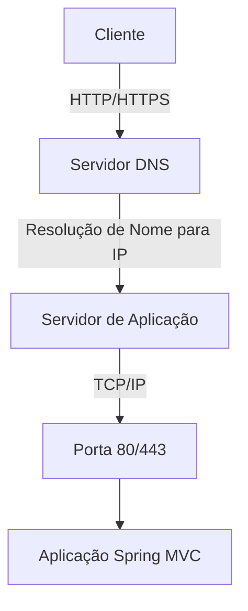
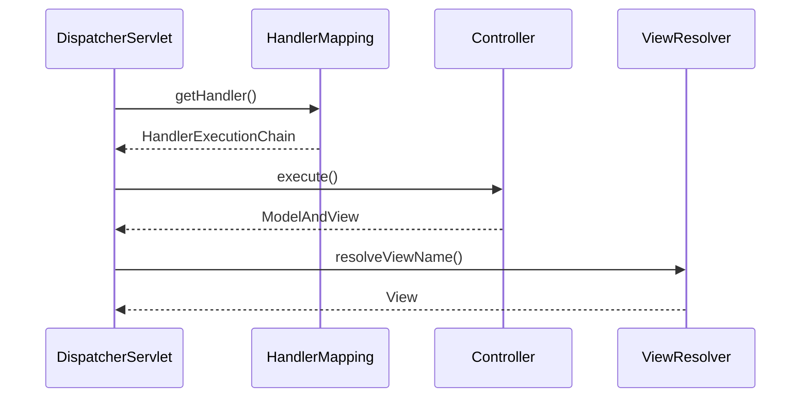
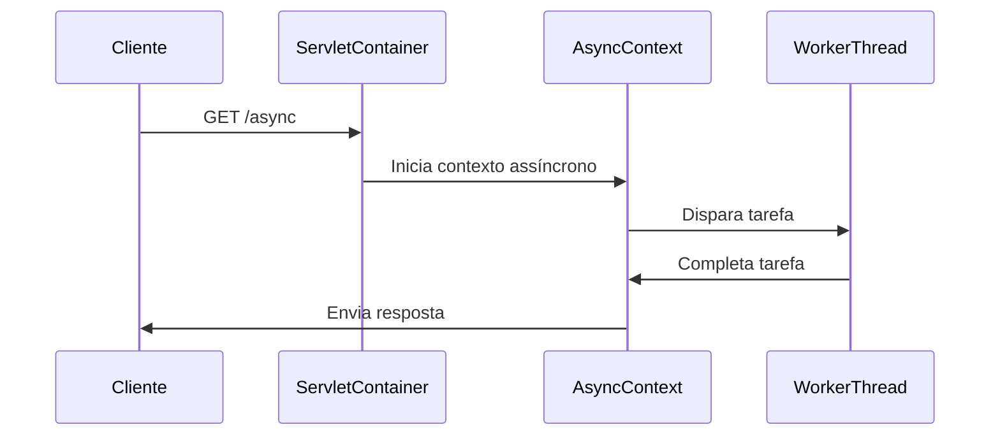
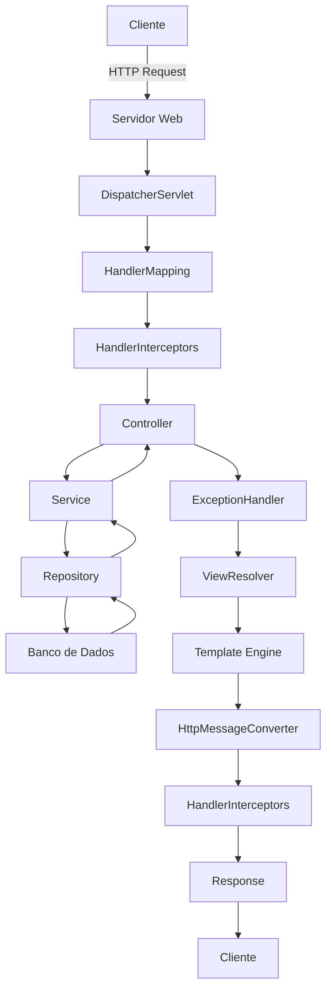

# Curso Completo: Tecnologias do Spring MVC em Aplicações Web
## Sumário
1. [Módulo 1: Tecnologias de Rede](#módulo-1-tecnologias-de-rede)
2. [Módulo 2: Servidores Web](#módulo-2-servidores-web)
3. [Módulo 3: Container Spring (DispatcherServlet)](#módulo-3-container-spring-dispatcherservlet)
4. [Módulo 4: Injeção de Dependência](#módulo-4-injeção-de-dependência)
5. [Módulo 5: Acesso a Dados](#módulo-5-acesso-a-dados)
6. [Módulo 6: Serialização](#módulo-6-serialização)
7. [Módulo 7: Validação](#módulo-7-validação)
8. [Módulo 8: Segurança](#módulo-8-segurança)
9. [Módulo 9: Cache](#módulo-9-cache)
10. [Módulo 10: HandlerInterceptors](#módulo-10-handlerinterceptors)
11. [Módulo 11: ExceptionHandlers](#módulo-11-exceptionhandlers)
12. [Módulo 12: ViewResolvers](#módulo-12-viewresolvers)
13. [Módulo 13: Async Processing](#módulo-13-async-processing)
14. [Fluxograma Completo do Sistema](#fluxograma-completo-do-sistema)
---
## Módulo 1: Tecnologias de Rede
**Aula 1.1: Fundamentos de Comunicação Web**



**Tópicos:**

1. **HTTP/HTTPS**: Protocolos de comunicação cliente-servidor
   - Métodos: GET, POST, PUT, DELETE
   - Códigos de status: 200, 404, 500
   - Segurança com TLS/SSL
   - 
2. **DNS**: Sistema de Nomes de Domínio
   - Traduz nomes amigáveis para endereços IP
   - Exemplo: `meusite.com` → `192.168.1.1
   - 
3. **TCP/IP**: Pilha de protocolos de rede
   - Estabelecimento de conexão (3-way handshake)
   - Controle de fluxo e erro
   - 
**Configuração Spring:**

```properties
## Módulo 2: Servidores Web
**Aula 2.1: Containers Servlet e Servidores Embarcados**
```java
// POM.xml para mudar servidor
<dependency>
    <groupId>org.springframework.boot</groupId>
    <artifactId>spring-boot-starter-web</artifactId>
    <exclusions>
        <exclusion>
            <groupId>org.springframework.boot</groupId>
            <artifactId>spring-boot-starter-tomcat</artifactId>
        </exclusion>
    </exclusions>
</dependency>
<dependency>
    <groupId>org.springframework.boot</groupId>
    <artifactId>spring-boot-starter-undertow</artifactId>
</dependency>
```
**Comparação de Servidores:**
| Servidor  | Vantagens                     | Casos de Uso          |
|-----------|-------------------------------|-----------------------|
| Tomcat    | Padrão, estável               | Aplicações gerais     |
| Jetty     | Leve, rápido                  | Microserviços        |
| Undertow  | Alto desempenho, non-blocking | Cargas pesadas       |

**Fluxo de Requisição:**

1. Recebe requisição HTTP
2. Cria HttpServletRequest/HttpServletResponse
3. Encaminha para DispatcherServlet
---

## Módulo 3: Container Spring (DispatcherServlet)

**Aula 3.1: O Cérebro do Spring MVC**



**Componentes:**

1. **HandlerMapping**: Mapeia URLs para controllers
2. **HandlerAdapter**: Executa métodos do controller
3. **ViewResolver**: Resolve nomes de views para implementações
**Configuração Personalizada:**
```java
@Configuration
public class WebConfig implements WebMvcConfigurer {
    
    @Override
    public void configureViewResolvers(ViewResolverRegistry registry) {
        registry.jsp("/WEB-INF/views/", ".jsp");
    }
    
    @Bean
    public HandlerMapping customHandlerMapping() {
        return new RequestMappingHandlerMapping();
    }
}
```
---
## Módulo 4: Injeção de Dependência

**Aula 4.1: Spring IoC Container**

```java
@Service
public class PedidoService {
    private final ProdutoRepository produtoRepo;
    
    // Injeção via construtor (recomendado)
    public PedidoService(ProdutoRepository produtoRepo) {
        this.produtoRepo = produtoRepo;
    }
}
@RestController
@RequestMapping("/pedidos")
public class PedidoController {
    
    @Autowired
    private PedidoService pedidoService;
}
```
**Tipos de Injeção:**

1. **Construtor**: Mais seguro e testável
2. **Setter**: Flexível para dependências opcionais
3. **Campo**: Simples mas menos testável
**Ciclo de Vida:**
1. Instanciação
2. População de propriedades
3. Inicialização (@PostConstruct)
4. Uso
5. Destruição (@PreDestroy)
---
## Módulo 5: Acesso a Dados

**Aula 5.1: Spring Data JPA e Hibernate**

```java
@Entity
public class Usuario {
    @Id
    @GeneratedValue(strategy = GenerationType.IDENTITY)
    private Long id;
    
    @Column(nullable = false, length = 100)
    private String nome;
    
    @OneToMany(mappedBy = "usuario")
    private List<Pedido> pedidos;
}
public interface UsuarioRepository extends JpaRepository<Usuario, Long> {
    Optional<Usuario> findByEmail(String email);
}
```
**Camadas de Acesso:**

1. **Repository**: Interface CRUD
2. **Service**: Lógica de negócio
3. **Controller**: Expõe endpoints
**Transações:**
```java
@Service
@Transactional
public class UsuarioService {
    
    public Usuario criarUsuario(UsuarioDTO dto) {
        // Operações atômicas
    }
}
```
---
## Módulo 6: Serialização
**Aula 6.1: Transformação de Dados com Jackson**

```java
@JsonInclude(Include.NON_NULL)
public class ProdutoResponse {
    @JsonProperty("id_produto")
    private Long id;
    
    @JsonFormat(pattern = "dd/MM/yyyy")
    private LocalDate dataCriacao;
}
@Configuration
public class JacksonConfig {
    @Bean
    public Module javaTimeModule() {
        return new JavaTimeModule();
    }
}
```
**Formatos Suportados:**

- JSON (padrão)
- XML (ativação manual)
- Protobuf, Avro (bibliotecas adicionais)
**Personalização:**
```java
@RestControllerAdvice
public class CustomResponseBodyAdvice implements ResponseBodyAdvice<Object> {
    @Override
    public Object beforeBodyWrite(Object body, MethodParameter returnType, 
                                  MediaType selectedContentType, Class selectedConverterType, 
                                  ServerHttpRequest request, ServerHttpResponse response) {
        // Transformação global
    }
}
```
---
## Módulo 7: Validação
**Aula 7.1: Bean Validation e Tratamento de Erros**

```java
public class UsuarioDTO {
    @NotBlank(message = "Nome é obrigatório")
    @Size(min = 3, max = 100)
    private String nome;
    
    @Email
    private String email;
}
@PostMapping
public ResponseEntity<?> criarUsuario(@Valid @RequestBody UsuarioDTO dto) {
    // ...
}
```
**Tratamento Global:**

```java
@ControllerAdvice
public class GlobalExceptionHandler {
    
    @ExceptionHandler(MethodArgumentNotValidException.class)
    public ResponseEntity<ErrorResponse> handleValidationExceptions(
            MethodArgumentNotValidException ex) {
        
        Map<String, String> errors = new HashMap<>();
        ex.getBindingResult().getAllErrors().forEach(error -> {
            String fieldName = ((FieldError) error).getField();
            String errorMessage = error.getDefaultMessage();
            errors.put(fieldName, errorMessage);
        });
        
        return ResponseEntity.badRequest()
                .body(new ErrorResponse("Erro de validação", errors));
    }
}
```
---
## Módulo 8: Segurança
**Aula 8.1: Spring Security**

```java
@Configuration
@EnableWebSecurity
public class SecurityConfig extends WebSecurityConfigurerAdapter {
    
    @Override
    protected void configure(HttpSecurity http) throws Exception {
        http
            .authorizeRequests()
                .antMatchers("/public/**").permitAll()
                .antMatchers("/admin/**").hasRole("ADMIN")
                .anyRequest().authenticated()
            .and()
            .formLogin()
                .loginPage("/login")
                .defaultSuccessUrl("/dashboard")
            .and()
            .logout()
                .logoutSuccessUrl("/login?logout");
    }
}
```
**Recursos Avançados:**

- OAuth2
- JWT (JSON Web Tokens)
- Prevenção contra CSRF
- CORS Configuration
- Method Security:
  ```java
  @PreAuthorize("hasRole('ADMIN') or #usuario.id == authentication.principal.id")
  public void atualizarUsuario(Usuario usuario) {
      // ...
  }
  ```
---
## Módulo 9: Cache
**Aula 9.1: Gerenciamento de Cache**

```java
@Configuration
@EnableCaching
public class CacheConfig {
    
    @Bean
    public CacheManager cacheManager() {
        return new ConcurrentMapCacheManager("produtos", "usuarios");
    }
}
@Service
public class ProdutoService {
    
    @Cacheable(value = "produtos", key = "#id")
    public Produto buscarPorId(Long id) {
        // Operação custosa
    }
    
    @CacheEvict(value = "produtos", key = "#id")
    public void atualizarProduto(Long id, Produto produto) {
        // ...
    }
}
```
**Estratégias de Cache:**

- TTL (Time-To-Live)
- LRU (Least Recently Used)
- Cache distribuído (Redis, Hazelcast)
---
## Módulo 10: HandlerInterceptors
**Aula 10.1: Interceptando Requisições**

```java
public class LoggingInterceptor implements HandlerInterceptor {
    
    @Override
    public boolean preHandle(HttpServletRequest request, 
                             HttpServletResponse response, 
                             Object handler) {
        // Antes do controller
        return true; // continuar execução
    }
    
    @Override
    public void postHandle(HttpServletRequest request, 
                           HttpServletResponse response, 
                           Object handler, 
                           ModelAndView modelAndView) {
        // Após controller (antes da view)
    }
}
@Configuration
public class WebConfig implements WebMvcConfigurer {
    
    @Override
    public void addInterceptors(InterceptorRegistry registry) {
        registry.addInterceptor(new LoggingInterceptor());
    }
}
```
**Casos de Uso:**

- Auditoria de requisições
- Validação de cabeçalhos
- Medição de tempo de execução
- Controle de acesso básico
---
## Módulo 11: ExceptionHandlers
**Aula 11.1: Tratamento Centralizado de Exceções**

```java
@ControllerAdvice
public class GlobalExceptionHandler {
    
    @ExceptionHandler(ResourceNotFoundException.class)
    public ResponseEntity<ErrorResponse> handleResourceNotFound(
            ResourceNotFoundException ex) {
        
        ErrorResponse error = new ErrorResponse(
            "NOT_FOUND",
            ex.getMessage(),
            System.currentTimeMillis()
        );
        
        return new ResponseEntity<>(error, HttpStatus.NOT_FOUND);
    }
    
    @ExceptionHandler(Exception.class)
    public ResponseEntity<ErrorResponse> handleAllExceptions(Exception ex) {
        // Tratamento genérico
    }
}
```
**Hierarquia de Exceções:**

1. Exceções específicas (ResourceNotFound)
2. Exceções de negócio (BusinessException)
3. Exceções genéricas (Exception)
---
## Módulo 12: ViewResolvers
**Aula 12.1: Renderização de Views**

```java
@Configuration
public class ThymeleafConfig {
    
    @Bean
    public SpringResourceTemplateResolver templateResolver() {
        SpringResourceTemplateResolver resolver = new SpringResourceTemplateResolver();
        resolver.setPrefix("classpath:/templates/");
        resolver.setSuffix(".html");
        return resolver;
    }
}
@Controller
public class ProdutoController {
    
    @GetMapping("/produto/{id}")
    public String detalheProduto(Model model, @PathVariable Long id) {
        model.addAttribute("produto", produtoService.buscarPorId(id));
        return "produto/detalhe"; // src/main/resources/templates/produto/detalhe.html
    }
}
```
**Tecnologias de Template:**

1. Thymeleaf (recomendado)
2. FreeMarker
3. JSP (legado)
---
## Módulo 13: Async Processing
**Aula 13.1: Processamento Assíncrono**

```java
@RestController
public class AsyncController {
    
    @GetMapping("/async")
    public CompletableFuture<String> asyncEndpoint() {
        return CompletableFuture.supplyAsync(() -> {
            try {
                Thread.sleep(5000); // Simula processamento demorado
            } catch (InterruptedException e) {
                Thread.currentThread().interrupt();
            }
            return "Resultado assíncrono";
        });
    }
}
```
**Configuração:**

```java
@Configuration
@EnableAsync
public class AsyncConfig implements AsyncConfigurer {
    
    @Override
    public Executor getAsyncExecutor() {
        ThreadPoolTaskExecutor executor = new ThreadPoolTaskExecutor();
        executor.setCorePoolSize(10);
        executor.setMaxPoolSize(50);
        executor.setQueueCapacity(100);
        executor.initialize();
        return executor;
    }
}
```
**Fluxo Assíncrono:**


---
## Fluxograma Completo do Sistema


---

Este fluxograma mostra o ciclo completo de uma requisição:
1. Cliente envia requisição HTTP
2. Servidor Web (Tomcat/Jetty) recebe
3. DispatcherServlet coordena o processamento
4. HandlerMapping encontra o controller adequado
5. Interceptors aplicam lógica transversal
6. Controller processa e chama services
7. Services usam repositories para acesso a dados
8. Dados são persistidos/recuperados do banco
9. Tratamento de exceções centralizado
10. Resolução da view e renderização
11. Serialização da resposta
12. Interceptors pós-processamento
13. Resposta enviada ao cliente

```
# application.properties
server.port=8443
server.ssl.key-store=classpath:keystore.p12
server.ssl.key-store-password=secret
```
---
## Módulo 2: Servidores Web
**Aula 2.1: Containers Servlet e Servidores Embarcados**

```java
// POM.xml para mudar servidor
<dependency>
    <groupId>org.springframework.boot</groupId>
    <artifactId>spring-boot-starter-web</artifactId>
    <exclusions>
        <exclusion>
            <groupId>org.springframework.boot</groupId>
            <artifactId>spring-boot-starter-tomcat</artifactId>
        </exclusion>
    </exclusions>
</dependency>
<dependency>
    <groupId>org.springframework.boot</groupId>
    <artifactId>spring-boot-starter-undertow</artifactId>
</dependency>
```
**Comparação de Servidores:**

| Servidor  | Vantagens                     | Casos de Uso          |
|-----------|-------------------------------|-----------------------|
| Tomcat    | Padrão, estável               | Aplicações gerais     |
| Jetty     | Leve, rápido                  | Microserviços        |
| Undertow  | Alto desempenho, non-blocking | Cargas pesadas       |
**Fluxo de Requisição:**

1. Recebe requisição HTTP
2. Cria HttpServletRequest/HttpServletResponse
3. Encaminha para DispatcherServlet
---
## Módulo 3: Container Spring (DispatcherServlet)
**Aula 3.1: O Cérebro do Spring MVC**


**Componentes:**

1. **HandlerMapping**: Mapeia URLs para controllers
2. **HandlerAdapter**: Executa métodos do controller
3. **ViewResolver**: Resolve nomes de views para implementações
4. 
**Configuração Personalizada:**

```java
@Configuration
public class WebConfig implements WebMvcConfigurer {
    
    @Override
    public void configureViewResolvers(ViewResolverRegistry registry) {
        registry.jsp("/WEB-INF/views/", ".jsp");
    }
    
    @Bean
    public HandlerMapping customHandlerMapping() {
        return new RequestMappingHandlerMapping();
    }
}
```
---
## Módulo 4: Injeção de Dependência
**Aula 4.1: Spring IoC Container**

```java
@Service
public class PedidoService {
    private final ProdutoRepository produtoRepo;
    
    // Injeção via construtor (recomendado)
    public PedidoService(ProdutoRepository produtoRepo) {
        this.produtoRepo = produtoRepo;
    }
}
@RestController
@RequestMapping("/pedidos")
public class PedidoController {
    
    @Autowired
    private PedidoService pedidoService;
}
```
**Tipos de Injeção:**

1. **Construtor**: Mais seguro e testável
2. **Setter**: Flexível para dependências opcionais
3. **Campo**: Simples mas menos testável
**Ciclo de Vida:**
1. Instanciação
2. População de propriedades
3. Inicialização (@PostConstruct)
4. Uso
5. Destruição (@PreDestroy)
---
## Módulo 5: Acesso a Dados
**Aula 5.1: Spring Data JPA e Hibernate**

```java
@Entity
public class Usuario {
    @Id
    @GeneratedValue(strategy = GenerationType.IDENTITY)
    private Long id;
    
    @Column(nullable = false, length = 100)
    private String nome;
    
    @OneToMany(mappedBy = "usuario")
    private List<Pedido> pedidos;
}
public interface UsuarioRepository extends JpaRepository<Usuario, Long> {
    Optional<Usuario> findByEmail(String email);
}
```
**Camadas de Acesso:**

1. **Repository**: Interface CRUD
2. **Service**: Lógica de negócio
3. **Controller**: Expõe endpoints
**Transações:**
```java
@Service
@Transactional
public class UsuarioService {
    
    public Usuario criarUsuario(UsuarioDTO dto) {
        // Operações atômicas
    }
}
```
---
## Módulo 6: Serialização
**Aula 6.1: Transformação de Dados com Jackson**

```java
@JsonInclude(Include.NON_NULL)
public class ProdutoResponse {
    @JsonProperty("id_produto")
    private Long id;
    
    @JsonFormat(pattern = "dd/MM/yyyy")
    private LocalDate dataCriacao;
}
@Configuration
public class JacksonConfig {
    @Bean
    public Module javaTimeModule() {
        return new JavaTimeModule();
    }
}
```
**Formatos Suportados:**

- JSON (padrão)
- XML (ativação manual)
- Protobuf, Avro (bibliotecas adicionais)
**Personalização:**
```java
@RestControllerAdvice
public class CustomResponseBodyAdvice implements ResponseBodyAdvice<Object> {
    @Override
    public Object beforeBodyWrite(Object body, MethodParameter returnType, 
                                  MediaType selectedContentType, Class selectedConverterType, 
                                  ServerHttpRequest request, ServerHttpResponse response) {
        // Transformação global
    }
}
```
---
## Módulo 7: Validação
**Aula 7.1: Bean Validation e Tratamento de Erros**

```java
public class UsuarioDTO {
    @NotBlank(message = "Nome é obrigatório")
    @Size(min = 3, max = 100)
    private String nome;
    
    @Email
    private String email;
}
@PostMapping
public ResponseEntity<?> criarUsuario(@Valid @RequestBody UsuarioDTO dto) {
    // ...
}
```
**Tratamento Global:**

```java
@ControllerAdvice
public class GlobalExceptionHandler {
    
    @ExceptionHandler(MethodArgumentNotValidException.class)
    public ResponseEntity<ErrorResponse> handleValidationExceptions(
            MethodArgumentNotValidException ex) {
        
        Map<String, String> errors = new HashMap<>();
        ex.getBindingResult().getAllErrors().forEach(error -> {
            String fieldName = ((FieldError) error).getField();
            String errorMessage = error.getDefaultMessage();
            errors.put(fieldName, errorMessage);
        });
        
        return ResponseEntity.badRequest()
                .body(new ErrorResponse("Erro de validação", errors));
    }
}
```
---
## Módulo 8: Segurança
**Aula 8.1: Spring Security**

```java
@Configuration
@EnableWebSecurity
public class SecurityConfig extends WebSecurityConfigurerAdapter {
    
    @Override
    protected void configure(HttpSecurity http) throws Exception {
        http
            .authorizeRequests()
                .antMatchers("/public/**").permitAll()
                .antMatchers("/admin/**").hasRole("ADMIN")
                .anyRequest().authenticated()
            .and()
            .formLogin()
                .loginPage("/login")
                .defaultSuccessUrl("/dashboard")
            .and()
            .logout()
                .logoutSuccessUrl("/login?logout");
    }
}
```
**Recursos Avançados:**

- OAuth2
- JWT (JSON Web Tokens)
- Prevenção contra CSRF
- CORS Configuration
- Method Security:
  ```java
  @PreAuthorize("hasRole('ADMIN') or #usuario.id == authentication.principal.id")
  public void atualizarUsuario(Usuario usuario) {
      // ...
  }
  ```
---
## Módulo 9: Cache
**Aula 9.1: Gerenciamento de Cache**

```java
@Configuration
@EnableCaching
public class CacheConfig {
    
    @Bean
    public CacheManager cacheManager() {
        return new ConcurrentMapCacheManager("produtos", "usuarios");
    }
}
@Service
public class ProdutoService {
    
    @Cacheable(value = "produtos", key = "#id")
    public Produto buscarPorId(Long id) {
        // Operação custosa
    }
    
    @CacheEvict(value = "produtos", key = "#id")
    public void atualizarProduto(Long id, Produto produto) {
        // ...
    }
}
```
**Estratégias de Cache:**

- TTL (Time-To-Live)
- LRU (Least Recently Used)
- Cache distribuído (Redis, Hazelcast)
---
## Módulo 10: HandlerInterceptors
**Aula 10.1: Interceptando Requisições**

```java
public class LoggingInterceptor implements HandlerInterceptor {
    
    @Override
    public boolean preHandle(HttpServletRequest request, 
                             HttpServletResponse response, 
                             Object handler) {
        // Antes do controller
        return true; // continuar execução
    }
    
    @Override
    public void postHandle(HttpServletRequest request, 
                           HttpServletResponse response, 
                           Object handler, 
                           ModelAndView modelAndView) {
        // Após controller (antes da view)
    }
}
@Configuration
public class WebConfig implements WebMvcConfigurer {
    
    @Override
    public void addInterceptors(InterceptorRegistry registry) {
        registry.addInterceptor(new LoggingInterceptor());
    }
}
```
**Casos de Uso:**

- Auditoria de requisições
- Validação de cabeçalhos
- Medição de tempo de execução
- Controle de acesso básico
---
## Módulo 11: ExceptionHandlers
**Aula 11.1: Tratamento Centralizado de Exceções**

```java
@ControllerAdvice
public class GlobalExceptionHandler {
    
    @ExceptionHandler(ResourceNotFoundException.class)
    public ResponseEntity<ErrorResponse> handleResourceNotFound(
            ResourceNotFoundException ex) {
        
        ErrorResponse error = new ErrorResponse(
            "NOT_FOUND",
            ex.getMessage(),
            System.currentTimeMillis()
        );
        
        return new ResponseEntity<>(error, HttpStatus.NOT_FOUND);
    }
    
    @ExceptionHandler(Exception.class)
    public ResponseEntity<ErrorResponse> handleAllExceptions(Exception ex) {
        // Tratamento genérico
    }
}
```
**Hierarquia de Exceções:**

1. Exceções específicas (ResourceNotFound)
2. Exceções de negócio (BusinessException)
3. Exceções genéricas (Exception)
---
## Módulo 12: ViewResolvers
**Aula 12.1: Renderização de Views**

```java
@Configuration
public class ThymeleafConfig {
    
    @Bean
    public SpringResourceTemplateResolver templateResolver() {
        SpringResourceTemplateResolver resolver = new SpringResourceTemplateResolver();
        resolver.setPrefix("classpath:/templates/");
        resolver.setSuffix(".html");
        return resolver;
    }
}
@Controller
public class ProdutoController {
    
    @GetMapping("/produto/{id}")
    public String detalheProduto(Model model, @PathVariable Long id) {
        model.addAttribute("produto", produtoService.buscarPorId(id));
        return "produto/detalhe"; // src/main/resources/templates/produto/detalhe.html
    }
}
```
**Tecnologias de Template:**

1. Thymeleaf (recomendado)
2. FreeMarker
3. JSP (legado)
---
## Módulo 13: Async Processing
**Aula 13.1: Processamento Assíncrono**

```java
@RestController
public class AsyncController {
    
    @GetMapping("/async")
    public CompletableFuture<String> asyncEndpoint() {
        return CompletableFuture.supplyAsync(() -> {
            try {
                Thread.sleep(5000); // Simula processamento demorado
            } catch (InterruptedException e) {
                Thread.currentThread().interrupt();
            }
            return "Resultado assíncrono";
        });
    }
}
```
**Configuração:**

```java
@Configuration
@EnableAsync
public class AsyncConfig implements AsyncConfigurer {
    
    @Override
    public Executor getAsyncExecutor() {
        ThreadPoolTaskExecutor executor = new ThreadPoolTaskExecutor();
        executor.setCorePoolSize(10);
        executor.setMaxPoolSize(50);
        executor.setQueueCapacity(100);
        executor.initialize();
        return executor;
    }
}
```

**Fluxo Assíncrono:**

---
## Fluxograma Completo do Sistema


Este fluxograma mostra o ciclo completo de uma requisição:
1. Cliente envia requisição HTTP
2. Servidor Web (Tomcat/Jetty) recebe
3. DispatcherServlet coordena o processamento
4. HandlerMapping encontra o controller adequado
5. Interceptors aplicam lógica transversal
6. Controller processa e chama services
7. Services usam repositories para acesso a dados
8. Dados são persistidos/recuperados do banco
9. Tratamento de exceções centralizado
10. Resolução da view e renderização
11. Serialização da resposta
12. Interceptors pós-processamento
13. Resposta enviada ao cliente
