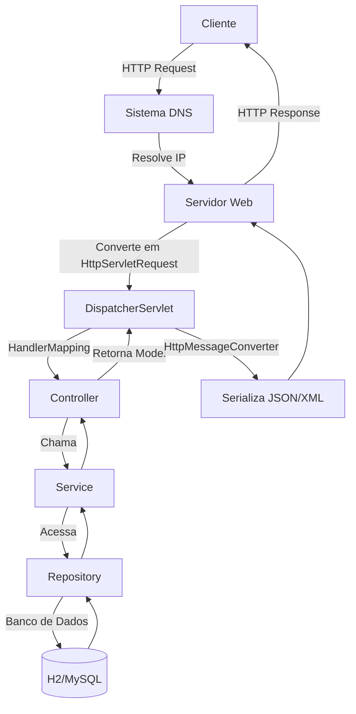

## Módulo 1: Tecnologias de Rede

### Aula 1.1: Fundamentos de Redes para Aplicações Web

**Conceito:**

As tecnologias de rede são a base da comunicação entre clientes (navegadores, apps) e servidores. Elas incluem:

- **Endereçamento IP**: Identifica dispositivos na rede (ex: IPv4 como `192.168.1.1`, IPv6 como `2001:db8::1`).

- **Portas**: Identificam aplicações em um dispositivo (ex: HTTP usa porta 80, HTTPS usa 443).

- **Protocolos de Transporte**: TCP (confiável, orientado a conexão) e UDP (rápido, não confiável).

**Exemplo Prático:**

Quando você acessa `http://localhost:8080`:
- `localhost` é resolvido para `127.0.0.1` (IPv4 loopback).
- `8080` é a porta onde sua aplicação Spring Boot está ouvindo.

**Configuração no Spring Boot:**

```properties

# application.properties

server.port=8080 # Altera a porta padrão (8080 é o default)

```

---

## Módulo 2: Protocolos de Comunicação Cliente-Servidor

### Aula 2.1: HTTP/HTTPS - O Sangue da Web

**HTTP (HyperText Transfer Protocol):**
- **Stateless**: Cada requisição é independente.
- **Métodos**: GET (ler), POST (criar), PUT (atualizar), DELETE (remover).
- **Códigos de Status**: 200 (OK), 404 (Não encontrado), 500 (Erro interno).

**HTTPS (HTTP Secure):**
- Adiciona criptografia via TLS/SSL.
- Garante autenticidade, confidencialidade e integridade.

**Exemplo de Requisição HTTP:**

```

GET /api/produtos HTTP/1.1
Host: localhost:8080
Accept: application/json

```

**Exemplo de Resposta:**

```

HTTP/1.1 200 OK
Content-Type: application/json
[{"id": 1, "nome": "Teclado"}]

```

**Spring Boot + HTTPS:**

1. Gere um keystore:

```bash

keytool -genkey -alias myapp -keyalg RSA -keystore keystore.p12 -validity 365 -storetype PKCS12

```

2. Configure:

```properties
server.ssl.key-store=classpath:keystore.p12
server.ssl.key-store-password=senha123
server.ssl.keyStoreType=PKCS12
server.ssl.keyAlias=myapp
```

---

## Módulo 3: Sistema de Nomes de Domínio (DNS)

### Aula 3.1: O "Listão Telefônico" da Internet

**Função:** Traduz nomes amigáveis (como `google.com`) em endereços IP (como `142.250.218.14`).

**Processo de Resolução DNS:**
1. Navegador pergunta ao **DNS Resolver** (do provedor).
2. Resolver consulta **Root Servers**.
3. Encaminhamento para **TLD Servers** (.com, .org).
4. Finalmente, **Authoritative Servers** do domínio respondem.

**Exemplo com `dig`:**

```bash

dig +short google.com

# Saída: 142.250.218.14

```

**Impacto em Aplicações:**

- Quando seu app Spring Boot acessa um serviço externo (ex: API de pagamento), ele usa DNS para resolver o hostname.

---

## Módulo 4: Pilha de Protocolos de Rede

### Aula 4.1: Como os Dados Viajam pela Rede

A comunicação segue o modelo **TCP/IP** (mais usado que OSI):

| Camada | Protocolos | Função | Exemplo no Spring Boot |
|-------------|---------------------|----------------------------------------|----------------------------------|
| Aplicação | HTTP, DNS, FTP | Dados específicos de aplicação | Controllers recebendo requisições |
| Transporte | TCP, UDP | Comunicação entre processos (portas) | Tomcat ouvindo na porta 8080 |
| Internet | IP, ICMP | Endereçamento e roteamento | Pacotes IP chegando ao servidor |
| Interface | Ethernet, Wi-Fi | Transmissão física de dados | Placa de rede do servidor |

**Exemplo de Fluxo TCP:**

1. **Handshake (3 vias):**
- Cliente: `SYN`
- Servidor: `SYN-ACK`
- Cliente: `ACK`

2. **Transferência de Dados**: Segmentos TCP contendo HTTP.

3. **Encerramento**: `FIN`/`ACK`.

---

## Módulo 5: Comparação de Servidores (Tomcat vs. Jetty vs. Undertow)

### Aula 5.1: Escolhendo o Motor do Seu App

Spring Boot suporta 3 servidores embarcados:

| Característica | Tomcat (Padrão) | Jetty | Undertow |
|----------------|-----------------------|------------------------|-------------------------------|
| Desempenho | Bom para geral | Excelente com conexões persistentes | Alto desempenho (non-blocking) |
| Recursos | Completo (Servlet, JSP, WebSocket) | Leve e modular | Leve, focado em non-blocking I/O |
| Casos de Uso | Apps tradicionais | Microserviços, alta concorrência | Cargas extremas, baixa latência |
| Configuração | `spring-boot-starter-web` | Excluir Tomcat e adicionar Jetty | Excluir Tomcat e adicionar Undertow |

**Mudando para Jetty:**

```xml
<dependencies>
    <dependency>
        <groupId>org.springframework.boot</groupId>
        <artifactId>spring-boot-starter-web</artifactId>
        <exclusions>
            <exclusion>
                <groupId>org.springframework.boot</groupId>
                <artifactId>spring-boot-starter-tomcat</artifactId>
            </exclusion>
        </exclusions>
        </dependency>
        <dependency>
        <groupId>org.springframework.boot</groupId>
        <artifactId>spring-boot-starter-jetty</artifactId>
    </dependency>
</dependencies>
```
---

## Módulo 6: Fluxo de Requisição no Spring Boot

### Aula 6.1: Da Requisição à Resposta

**Passo a Passo:**

1. **Cliente**: Envia requisição HTTP (ex: `GET /api/produtos`).

2. **Servidor Web (Tomcat/Jetty/Undertow)**:
- Recebe bytes brutos.
- Converte em objetos Java (`HttpServletRequest`, `HttpServletResponse`).

3. **DispatcherServlet (Spring MVC)**:
- Recebe a requisição.
- Consulta `HandlerMapping` para encontrar o controller adequado.

4. **Controller**:
- Método anotado (ex: `@GetMapping("/api/produtos")`).
- Valida parâmetros, chama serviços.

5. **Service & Repository**:
- Lógica de negócio.
- Acesso ao banco de dados (via Spring Data JPA, JDBC).

6. **Resposta**:
- Controller retorna dados (ex: `List<Produto>`).
- `HttpMessageConverter` converte para JSON (usando Jackson).

7. **Servidor Web**: Envia resposta HTTP de volta ao cliente.

**Exemplo de Controller:**

```java
@RestController
@RequestMapping("/api/produtos")
public class ProdutoController {

@GetMapping
public List<Produto> listar() {
return produtoService.listarTodos();
}
}
```
---
## Fluxograma do Curso



**Legenda:**
- **Cliente**: Navegador, Postman, app móvel.
- **Sistema DNS**: Traduz nome de domínio para IP.
- **Servidor Web**: Tomcat, Jetty ou Undertow.
- **DispatcherServlet**: Ponto de entrada do Spring MVC.
- **Controller**: Recebe a requisição e orquestra a resposta.
- **Service**: Regras de negócio.
- **Repository**: Acesso a dados.
- **Banco de Dados**: Armazenamento persistente.
- **Serialização**: Transforma objetos Java em JSON/XML.